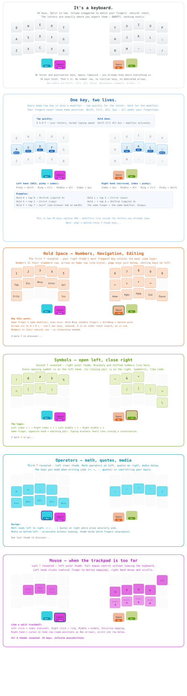
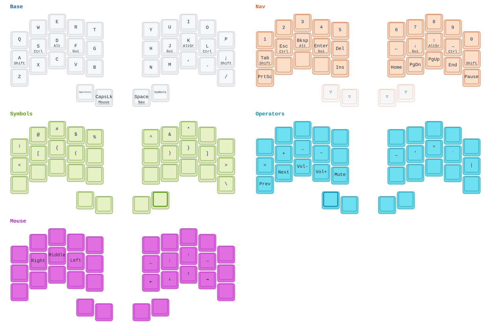

# 🎵 Orpheus

_Personal keymap configurations for 40% mechanical keyboards — and an account of why they look the way they do._

`34 keys` · `5 layers` · `home-row mods on both hands` · `11 boards since 2022` · `Vial · QMK · VIA`



Three years of narrowing down, from a 60% board to 34 keys. Below, in order: what is
here, how it got here, and why. None of it is a recommendation — it is one layout
explained in enough detail that you can judge it, steal from it, or decide it is not
for you.

The diagram above reveals itself in six passes: the base letters, then the modifiers
hiding under them, then each of the four layers as its thumb key is unlocked. The `?` marks
are deliberate — they are the four thumb keys, and the whole design hangs off them.

## Keyboard collection

**34-key split (daily driver):**
- SplitKB Halcyon Ferris — _column-stagger, Vial_

**52-key split:**
- ZSA Voyager — _column-stagger, Oryx_

**40% (rotation):**
- Epomaker TH40 — _Black Gold (QMK/VIA), Purple (VIA)_
- Vortex Core Plus — _Black/Brown_
- Keychron Q9 / Q9 Plus — _Black, Blue, White_
- Windstudio Hola Mini — _Vial_
- YMDK Ferris — _Vial_ · [keymap](keyboards/ymdk/ymdk-ferris.svg)

**60% (retired):**
- Custom DZ60RGB — _Gray_
- Keychron Q4 — _Blue_

## The journey — from 60% to 34 keys

| Period | Keyboard | Keys | What changed |
|--------|----------|------|--------------|
| Nov 2022 | DZ60RGB | 60% | First custom, first VIA config |
| Feb 2023 | Keychron Q4 + Q0 | 60% + numpad | Separated the numpad — thinking in modules |
| Apr 2023 | Keychron Q9 | 40% | The jump. 18 months of intense iteration |
| Jan 2024 | Keychron Q9 Plus | 40% + knob | Layers stabilize |
| Oct 2024 | Epomaker TH40 ×2 | 40% | Multi-mode (BT, 2.4GHz). Two units, daily refinement |
| Apr 2025 | Vortex Core Plus | 40% | Third brand, same philosophy |
| May 2025 | Windstudio Hola Mini | 40% | First Vial board |
| May 2025 | YMDK Ferris | 34, split | First split. Tap-dance for accents |
| Jun 2025 | ZSA Voyager | 52, split | First premium split. Validates column-stagger. Layout on [Oryx](https://configure.zsa.io/) |
| Aug 2025 | SplitKB Halcyon Ferris | 34, split | Daily driver. The destination |

Each step removed keys and added firmware intelligence. Read the table as a slow transfer of
complexity from hardware to software — and note that the split came late. Splitting the board
and cutting to 34 keys are separate decisions that are easy to conflate.

## The premise

A conventional keyboard gives you about 100 keys and asks your hands to travel. A 34-key
board gives you 34 and asks your firmware to think. Neither is obviously right — the
question is where you want the complexity to sit.

Put it in the hardware and every character has its own key, at the cost of reaching for
most of them. Put it in the firmware and your fingers stay home, at the cost of holding
something down to reach half the alphabet's neighbours. This repo is the second bet, taken
about as far as it goes.

The bet only pays if two things hold. **Your fingers must never leave home position** —
otherwise you have traded reaching for reaching-plus-thinking, which is worse. And **every
layer must be reachable by a thumb** — the strongest, least busy digit, the one not
carrying any letters. Both constraints do most of the design work for you.

<details>
<summary><strong>The same keymap, drawn from the config file</strong></summary>

Generated with [keymap-drawer](https://github.com/caksoylar/keymap-drawer) — dense,
unglossed, and always in sync with the `.vil`.



</details>

## What it costs

An honest account, since the diagrams make it look free.

**Home-row mods are miserable for about three weeks.** You will hold a letter a fraction too
long and get a modifier instead. The fix is a tapping term — 175 ms here — and the tapping
term is a genuine trade: too short and fast typing produces stray modifiers, too long and
deliberate holds feel sticky. There is no value that is right for everyone, and finding
yours takes weeks of real typing, not an afternoon.

**Combos and home-row mods fight each other.** A combo fires when two keys go down within a
few milliseconds. But a home-row mod key starts its own hold timer the instant it is pressed.
Put a combo on two adjacent home-row keys and the two mechanisms race: press `F`+`D`
together and you will get `Cmd+D`, or a bare `d`, or nothing, depending on which timer wins.
Nothing in the firmware warns you. The rule that follows is simple — **combos belong on the
top and bottom rows, never on two adjacent home-row mods** — and it cost a real debugging
session to learn. It is written up in full in the audit.

**Anything that fights the modifier order is friction.** `Cmd+X` on macOS means holding Gui
and tapping `X`. If `X` also carries a mod-tap, its hold timer starts too, and the sequence
becomes timing-sensitive for no benefit. Those mod-taps were leftovers; removing them fixed
a class of bugs that had never been diagnosed as one.

**And the obvious one:** every keyboard that is not this one becomes slightly foreign. That
is the actual price of the bet, and it is not small.

## Design rationale

The full reasoning — layer-by-layer snapshot, known weaknesses, combo-vs-layer theory, the
`F`+`D` diagnosis, and the leads still open — lives in
[Halcyon Ferris — Audit](keyboards/splitkb/splitkb-halcyon-ferris-audit.md). It is kept
current with the config rather than written once.

## Repository structure

```
keyboards/
├── splitkb/          Halcyon Ferris (Vial + firmware + SVGs + audit)
├── epomaker/         TH40 variants (VIA + QMK)
├── keychron/         Q0, Q4, Q9, Q9 Plus
├── vortex/           Core Plus
├── windstudio/       Hola Mini
├── ymdk/             Ferris
└── dz/               DZ60RGB
admin/                SVG generation, board registry, sync gesture
local/                Nushell keyboard utilities
```

## Tools

- **Firmware**: QMK, VIA, Vial
- **Visualization**: the annotated SVG above is hand-drawn; the technical one comes from
  [keymap-drawer](https://github.com/caksoylar/keymap-drawer) via `admin/vil-to-svg.nu`
  and a board registry in `admin/keyboards.nuon`
- **Maintenance**: `admin/keymap-sync.nu` redraws the diagrams and reports what changed —
  including keys left pointing at nothing
- **Shell**: Nushell throughout

## License

MIT — see [LICENSE.md](LICENSE.md). The configs are free to take; the reasoning is the part
worth reading first.

---

> _As Orpheus' music could move stones, these keymaps aim to make code flow effortlessly._
